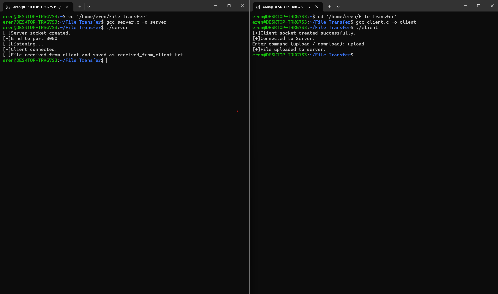

# Server-Client File Transfer Socket Programming with C

This is a simple file transfer application using TCP socket programming in C. It allows the **client** to upload a file to the **server**, or download a file from the server.

---

##  Features

- File upload from client to server
- File download from server to client
- Communication over TCP sockets
- Simple command interface

---

##  How It Works

1. **Start the server**  
   Open a terminal and run:  
   gcc server.c -o server   
   ./server   

3. **Start the client**  
Open another terminal and run:  
gcc client.c -o client  
./client    

4. **Choose operation**
The client will prompt:  
Enter command (upload / download):  
Type upload to send client_file.txt to the server (saved as recv.txt)   
Type download to receive server_file.txt from the server (saved as downloaded_from_server.txt)   

**Upload Demo**

👨‍💻 Author  
Eren Demiray  
